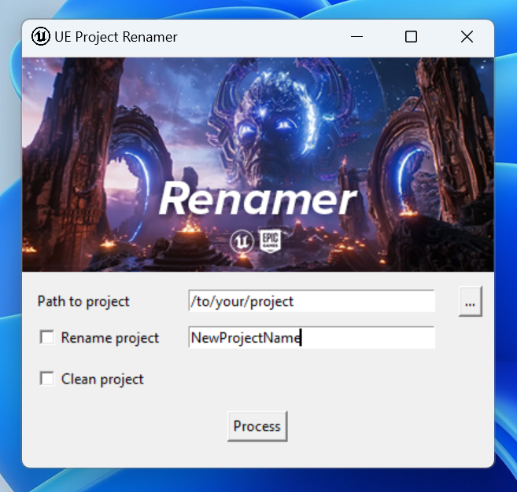

# UEProjectRenamer



## Overview
UEProjectRenamer is a utility tool designed for Unreal Engine developers to streamline the process of renaming and cleaning up Unreal Engine projects. This simple yet powerful tool allows users to quickly rename their projects and clean out temporary files with a user-friendly interface.

## Features
- **Project Renaming**: Easily rename your Unreal Engine project with a new name.
- **Project Cleaning**: Remove temporary files such as `.vs`, `Binaries`, `Intermediate`, etc., to clean up your project directory.
- **Intuitive GUI**: A simple and intuitive graphical user interface for ease of use.

## Getting Started

### Prerequisites
- Python 3.x
- Pillow library for Python
- Tkinter library for Python (usually comes with Python installation)

### Installation
Clone the repository or download the source code:

```bash
git clone https://github.com/vladgohn/UEProjectRenamer.git
cd UEProjectRenamer
```

Install the required dependencies:

```bash
pip install -r requirements.txt
```

### Usage
Run the application:

```bash
python app.py
```

Select the desired actions on the GUI and process your Unreal Engine project accordingly.

### Building Executable
To build the application into an executable, run:

```bash
pyinstaller --onefile --noconsole --icon="ui/icon.ico" --add-data="ui/banner.jpg;ui" --add-data="ui/icon.png;ui" app.py
```

The executable will be located in the `dist` folder.

## Contributing
Contributions are welcome. Please open an issue first to discuss what you would like to change or add.

## License
[MIT](https://choosealicense.com/licenses/mit/)
